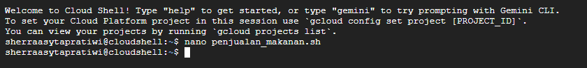
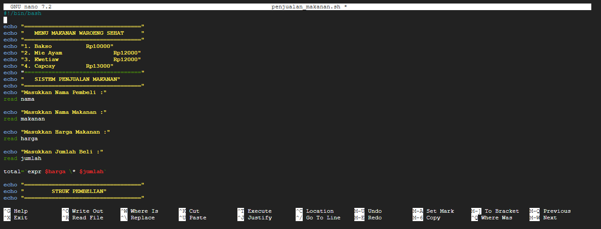
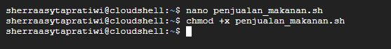
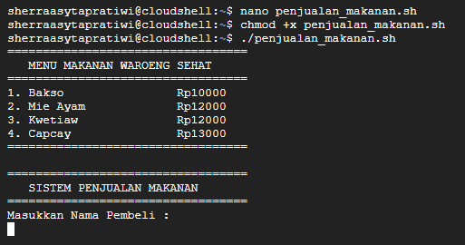
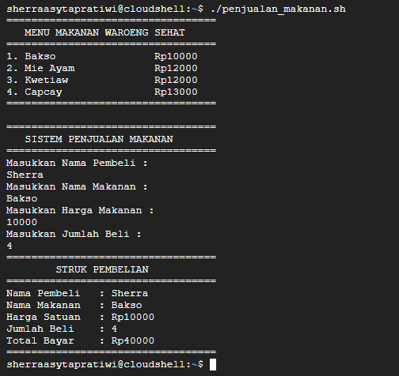

# Sistem Penjualan Makanan

Aplikasi kasir sederhana berbasis CLI (Command Line Interface) yang dibuat menggunakan Bash Script untuk mencatat pembelian makanan secara cepat dan praktis.

## Tampilan Aplikasi
Berikut adalah dokumentasi tampilan dari sistem penjualan:

<p align="center">
  
  
  
  
  
</p>

## Fitur Utama
* **Daftar Menu:** Menampilkan daftar menu makanan (Bakso, Mie Ayam, Kwetiaw, Capcay) beserta harganya.
* **Input Interaktif:** Menerima input nama pembeli, nama makanan, harga, dan jumlah beli melalui terminal.
* **Kalkulasi Otomatis:** Menghitung total harga pembayaran menggunakan ekspresi matematika.
* **Struk Pembelian:** Menghasilkan ringkasan atau struk pembelian setelah data diinput.

## Teknologi yang Digunakan
* **Bahasa Pemrograman:** Bash Shell Scripting.
* **Sistem Operasi:** Disarankan dijalankan pada lingkungan Linux, Cloud Shell.

## Prasyarat Instalasi
Pastikan sistem Anda sudah terinstall Bash. Ikuti langkah berikut untuk menjalankan project:

1. **Clone repository ini:**
   ```bash
   git clone [https://github.com/sherraasyta/Sistem-Penjualan-Makanan.git](https://github.com/sherraasyta/Sistem-Penjualan-Makanan.git)
